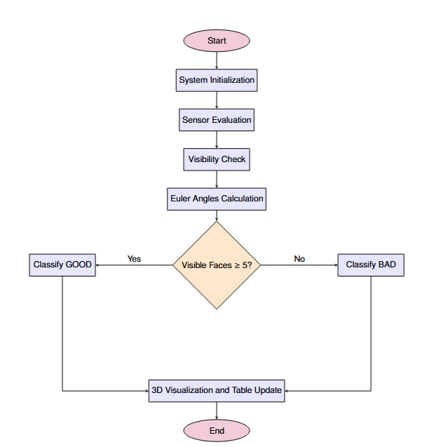
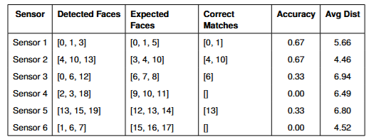

#  Multi-Sensor 3D View Planning & Calibration Toolkit

This repository contains a modular Python-based system for simulating and evaluating multi-camera calibration using a 3D calibration object (icosahedron) and multiple sensor viewpoints. Developed as part of a Master’s thesis at FAU Erlangen-Nürnberg.


### 🧭 Methodology Workflow
  
*Figure: Workflow for evaluating and classifying sensor views using Euler angle and face visibility checks.*


##  Overview

The project enables sensor visibility analysis, 3D visualization, and pose estimation using a structured and modular Python implementation. It evaluates how well sensors can detect different faces of a calibration object based on angles, distance, and orientation.


##  Project Structure

```
pythonProject1/
├── Calibration_object_data/       # Geometry or model data for the calibration object
├── Pose_estimation_6/             # Multi-sensor or camera pose estimation logic
├── Single_Sensor_testing/         # Scripts to test visibility of individual sensors
├── System_initialization/         # Initialization code and configuration routines
├── Testing/                       # Test scripts and experimental runs
├── Visualisation/                 # 3D visualization and PyQt-based GUI tools
├── README.md                      # Project documentation
└── .venv/                         # Python virtual environment (excluded in .gitignore)


##  Getting Started

### Prerequisites

Make sure Python 3.8+ is installed. Then, install the required libraries:

```bash
pip install numpy pandas matplotlib PyQt5
```

###  Running the 3D Viewer

Navigate to the visualization folder or the main GUI file and run:

```bash
python orientation.py
```
.png)  
*Figure: 3D Sensor View Visualization.The six sensors are positioned symmetrically around
the calibration object, illustrating direction vectors and face visibility.

### Accuracy Evaluation

To evaluate how accurately sensors detect the correct faces:

```bash
python accuracy_@.py
```

Ensure the file `sensor_distance.csv` is available in the same directory or update the path accordingly.
  
*Figure:Sensor Accuracy and Distance Evaluation. Face detection accuracy and average
distance per sensor. 

Sensor: Identifies the sensor being evaluated.
■ Detected Faces: The top 3 face indices (rows) with the lowest measured distances, interpreted
as the sensor’s guesses of visible targets.
■ Expected Faces: The correct/ground truth face indices that the sensor should have detected.
■ Correct Matches: Intersection between Detected and Expected faces — i.e., correctly identified
targets.
■ Accuracy Score: Accuracy = Number of Correct Matches
Number of Expected Faces
■ Avg Distance: Mean of all distances recorded by the sensor to each face — a lower value
generally means better proximity or fewer occlusions
## Sample Output

```
Sensor 1:
  Detected Face Indices : [0, 1, 3]
  Expected Faces         : [0, 1, 5]
  Correct Matches        : [0, 1]
  Accuracy Score         : 0.67
  Avg Distance           : 5.66
```


## Key Concepts

- **Sensor Visibility**: Determines how many icosahedron faces each sensor can see.
- **GOOD/BAD Classification**: A sensor is labeled GOOD if it detects 5 or more faces.
- **3D Visualization**: Real-time rendering of sensor frustums and face orientations.
- **Evaluation Metrics**: Accuracy based on match between detected and expected faces.

---

## Scientific Context

This project supports the academic Report:

**"View Planning for 3D Multi-Camera Calibration with an Industrial Robot"**  
by Maha Saad — FAU Erlangen-Nürnberg, 2025


## Troubleshooting

- **FileNotFoundError**: Ensure CSV files like `Camera_calibration_object_poses.csv` are in the correct directory (e.g., `Calibration_object_data/`).
- **GUI Not Launching**: Ensure PyQt5 is installed and you're running with a GUI-capable environment.


## License

This project is part of academic research. For reuse beyond educational purposes, contact the author.


## 🙋‍♀️ Author

**Maha Saad**  
Master’s Program in Artificial Intelligence  
Friedrich-Alexander-Universität Erlangen-Nürnberg
